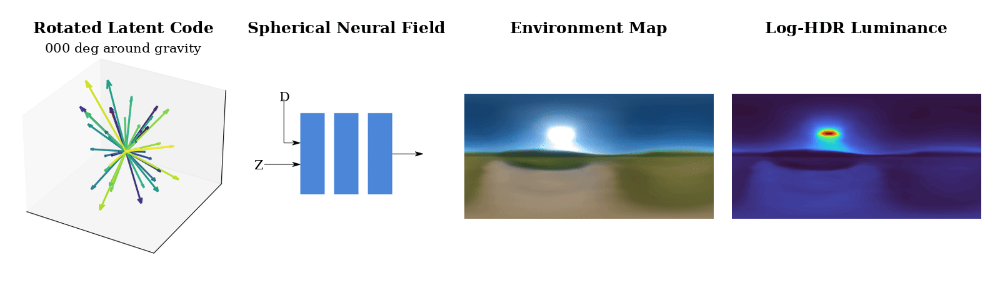

# RENI++

### Official Nerfstudio Implementation of RENI++

Paper: RENI++: A Rotation-Equivariant, Scale-Invariant, Natural Illumination Prior



## Installation

RENI++ is a nerfstudio extension. It requires CUDA 12.8, Python 3.12,
PyTorch 2.x, tiny-cuda-nn, and Nerfstudio revision
`50e0e3c70c775e89333256213363badbf074f29d`. The recommended way to run it
is via Docker or Apptainer (for HPC clusters).

### Option 1: Docker (recommended for local machines)

Requires the [NVIDIA Container Toolkit](https://docs.nvidia.com/datacenter/cloud-native/container-toolkit/).

```bash
git clone https://github.com/JADGardner/ns_reni.git
cd ns_reni
```

**Set up data and model directories.** Set the host paths in your shell or a
`.env` file in the project root:

```bash
# .env
DATA_PATH=/path/to/datasets
MODEL_STORAGE_PATH=/path/to/pretrained-models
OUTPUTS_PATH=/path/to/outputs
```

Path resolution also supports `DATA_PATH`, `MODEL_STORAGE_PATH` and
`OUTPUTS_PATH` when running outside the container; no compatibility symlinks
are required.

**Build and run:**

```bash
# Build the image (compiles CUDA extensions — takes 20-40 min first time)
docker compose build research

# Verify a clean clone
docker compose run --rm research python .apptainer/test_container.py

# Start an interactive shell
docker compose run research bash

# Or train directly
docker compose run research ns-train reni --data /workspace/data/RENI_HDR
```

Inside the container, the project is mounted at `/workspace` with:
- `/workspace/data` -- datasets
- `/workspace/outputs` -- training outputs
- `/workspace/model-storage` -- pretrained checkpoints

### Option 2: Apptainer (recommended for HPC clusters)

See the `.apptainer/` directory for HPC/SLURM setup.

```bash
git clone https://github.com/JADGardner/ns_reni.git
cd ns_reni

# Configure host paths
cp .apptainer/.env.example .apptainer/.env
# Edit .apptainer/.env with your cluster's data/model/output paths

# Build the SIF image + overlay (submit as a SLURM job on HPC)
.apptainer/apptainer.sh build

# Register ns_reni code in the overlay
.apptainer/apptainer.sh install

# Interactive shell
.apptainer/apptainer.sh shell

# Run a command
.apptainer/apptainer.sh exec -- ns-train reni --help

# Verify the container
.apptainer/apptainer.sh exec -- python .apptainer/test_container.py
```

### Option 3: Manual install (conda)

```bash
git clone https://github.com/JADGardner/ns_reni.git
cd ns_reni
conda create --name reni -y python=3.12
conda activate reni
pip install torch torchvision torchaudio --extra-index-url https://download.pytorch.org/whl/cu128
conda install -c conda-forge colmap -y
sudo apt install libopenexr-dev  # or: conda install -c conda-forge openexr
pip install ninja git+https://github.com/NVlabs/tiny-cuda-nn/#subdirectory=bindings/torch
NERFSTUDIO_COMMIT=50e0e3c70c775e89333256213363badbf074f29d
git init nerfstudio
git -C nerfstudio remote add origin \
  https://github.com/nerfstudio-project/nerfstudio.git
git -C nerfstudio fetch --depth 1 origin "$NERFSTUDIO_COMMIT"
git -C nerfstudio checkout --detach FETCH_HEAD
cd nerfstudio && pip install -e . && cd ..
pip install -e .
```

#### Troubleshooting

- `-lcuda not found`
  - Solution: `ln -s {cuda directory}/lib/stubs/libcuda.so {cuda directory}/lib/libcuda.so`

## Download Data and Pretrained Models

Download the public
[RENI HDR v1.0 dataset](https://huggingface.co/datasets/jadgardner/reni-hdr):

```bash
python3 scripts/download_data.py ./data/
```

The downloader retrieves the tagged Hugging Face release, verifies its
SHA256, and extracts `./data/RENI_HDR`. GNU `tar` and `zstd` are required.
Release provenance, per-file checksums, split counts, and direct
`curl`/Hugging Face CLI instructions are recorded on the dataset page.

The inverse-rendering bunny and teapot normal maps are reproducibly generated
from checksum-pinned public meshes:

```bash
python scripts/inverse_rendering_assets/build_normal_maps.py \
  --output-dir data/RENI_HDR/3d_models/normal_maps
```

See [`scripts/inverse_rendering_assets/README.md`](scripts/inverse_rendering_assets/README.md)
for source attribution, licence notes and reference-fidelity checks.

Download the current thesis model:

```bash
python3 scripts/download_models.py model-storage/reni
```

This retrieves the joint Gram-Schmidt, two-bracket, two-cycle D=100 model
used as the thesis headline result. The downloader uses the tagged
[RENI Models v1.2 release](https://huggingface.co/jadgardner/reni-models)
and verifies every downloaded file against `MODEL_MANIFEST.json`.

Other release groups are opt-in:

```bash
# PyTorch-only decoder and a locked CPU rendering example
python3 scripts/download_models.py model-storage/reni --group minimal

# Exact channelwise two-bracket prior used by NeuSky
python3 scripts/download_models.py model-storage/reni --group neusky-prior

# Current thesis size, equivariance, invariant and seed experiments
python3 scripts/download_models.py model-storage/reni --group thesis

# Final checkpoints from the published RENI/RENI++ experiments
python3 scripts/download_models.py model-storage/reni --group published
```

Use `python3 scripts/download_models.py --list` to inspect the exact model
identifiers. The release page also provides direct `curl` and Hugging Face
CLI access.

For the lightweight path, continue with:

```bash
cd model-storage/reni/minimal
uv run render.py --weights decoder.pt --output-dir render
```

This path uses only PyTorch, NumPy and Pillow. It includes the complete
reusable prior, including the learned joint Vector Neuron frame and
two-bracket HDR reconstruction, but deliberately omits Nerfstudio, training
latents and optimiser state. See
[`examples/minimal_inference/README.md`](examples/minimal_inference/README.md)
for the artifact contract.

## Citation

Please cite the RENI and RENI++ publications:

```bibtex
@inproceedings{gardner2022reni,
  title     = {Rotation-Equivariant Conditional Spherical Neural Fields for
               Learning a Natural Illumination Prior},
  author    = {Gardner, James A. D. and Egger, Bernhard and
               Smith, William A. P.},
  booktitle = {Advances in Neural Information Processing Systems},
  volume    = {35},
  pages     = {26309--26323},
  year      = {2022}
}

@article{gardner2026renipp,
  title   = {{RENI++}: A Rotation-Equivariant, Scale-Invariant, Natural
             Illumination Prior},
  author  = {Gardner, James A. D. and Egger, Bernhard and
             Smith, William A. P.},
  journal = {IEEE Transactions on Pattern Analysis and Machine Intelligence},
  year    = {2026},
  doi     = {10.1109/TPAMI.2026.3691593}
}
```
