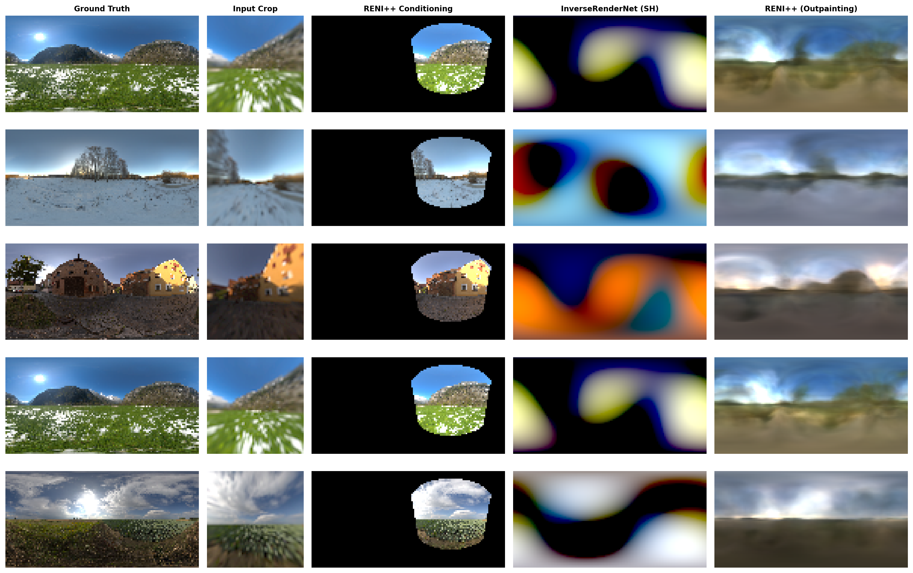
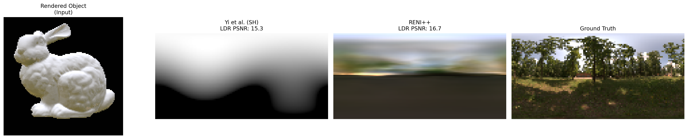
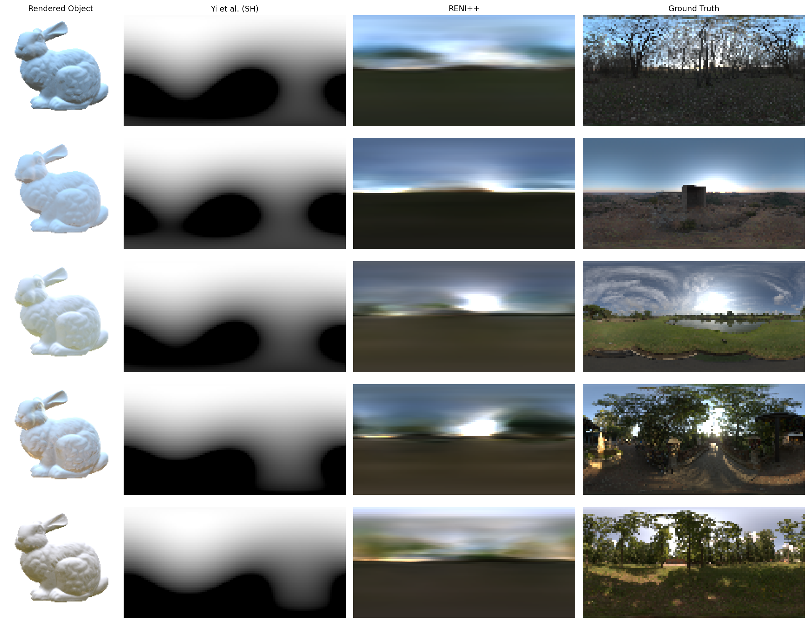
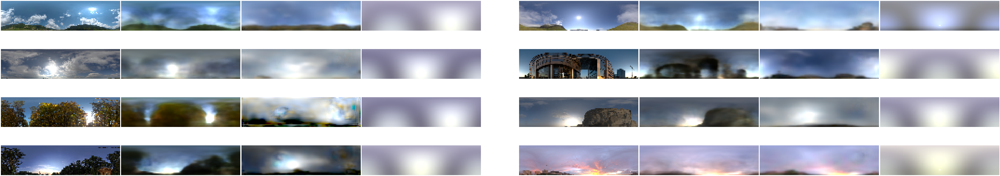

# Response to Reviewers — TPAMI-2023-12-2629.R1

## "RENI++: A Rotation-Equivariant, Scale-Invariant, Natural Illumination Prior"

We thank all reviewers for their thorough and constructive feedback. We have carefully addressed every concern raised in this revision. Below, we respond to each reviewer's comments individually, with references to the specific changes made in the revised manuscript.

---

## Response to Reviewer 2

We sincerely thank Reviewer 2 for their continued support of this work and their recognition of RENI++ as a useful contribution to the inverse rendering community. We appreciate the reviewer's candid observation that our previous revision did not adequately address the comparison requests from Reviewer 1 (now Reviewer 3/4). We have taken this feedback seriously and have now conducted extensive quantitative comparisons against multiple non-SH/SG baseline methods, as detailed below.

**New comparisons added in this revision:**

1. **SOLD-Net** [Tang et al., ECCV 2022] — A neural outdoor lighting estimation method with disentangled sky/sun representation, as specifically requested by Reviewer 4.
2. **Hosek-Wilkie Sky Model** [Hosek & Wilkie, 2012] — The standard analytical sky-dome radiance model used widely in graphics.
3. **InverseRenderNet** [Yu & Smith, CVPR 2019] — A single-image inverse rendering method that predicts SH lighting, as requested by Reviewer 3.

These comparisons are presented in detail in our responses to Reviewers 3 and 4 below.

---

## Response to Reviewer 3

We thank Reviewer 3 for their detailed feedback and apologise for the shortcomings in our previous response letter. We have taken great care to ensure this revision is thorough, complete, and addresses every point raised.

### Q1: Comparisons with suggested methods [1–3]

**A1:** We have carefully analysed each of the three suggested methods and conducted comparisons where applicable.

**[2] Yu & Smith, CVPR 2019 — InverseRenderNet:**
We have implemented a direct comparison against InverseRenderNet. This method predicts a 2nd-order SH lighting representation from a single outdoor image. To compare, we use InverseRenderNet's predicted SH lighting against RENI++'s estimated illumination on the same input images, evaluating both against ground-truth HDR environment maps from the Laval Sky HDR dataset.

| Method | LDR PSNR ↑ | SSIM ↑ |
|--------|------------|--------|
| **RENI++** | **17.49** | **0.7108** |
| InverseRenderNet | 8.99 | 0.0795 |

RENI++ outperforms InverseRenderNet by +8.5 dB LDR PSNR and substantially higher SSIM (0.71 vs 0.08). The qualitative comparison below shows that InverseRenderNet's 2nd-order SH prediction captures only the coarsest lighting direction and produces visible colour banding artefacts, while RENI++ recovers significantly more detail:

**[1] Liang et al., ECCV 2024 — Photorealistic Object Insertion with Diffusion-Guided Inverse Rendering:**
This method addresses a fundamentally different task: photorealistic object compositing via diffusion-guided per-scene environment map optimisation. It does not learn a generative prior over illumination distributions — instead, it optimises a single environment map per scene using score distillation from a personalised diffusion model. As such, it is not an illumination representation or prior that can be compared on the task of environment map reconstruction. We have cited this work in our revised Related Work section and clarified the distinction.

**[3] Yi et al., CVPR 2023 — Weakly-supervised Single-view Image Relighting:**
We have implemented a direct comparison against Yi et al.'s publicly available code (https://github.com/renjiaoyi/imagerelighting). Their model predicts inverse rendering properties (normals, lighting as 2nd-order SH, materials) from a single image of a segmented foreground object. To create a fair comparison, we rendered a synthetic object (Stanford Bunny) under each ground-truth HDR environment map using Blinn-Phong shading, then fed the rendered images to both Yi et al.'s model and RENI++ (via latent code optimisation). Both methods attempt to recover the illumination from the object's appearance.

| Method | LDR PSNR ↑ | SSIM ↑ |
|--------|------------|--------|
| **RENI++** | **20.26** | **0.4992** |
| Yi et al. | 16.38 | 0.2345 |

RENI++ outperforms Yi et al. by +3.9 dB LDR PSNR and more than double the SSIM (0.50 vs 0.23). As shown in the qualitative comparison below, Yi et al.'s monochrome SH output captures only the dominant light direction as a smooth gradient, while RENI++ recovers colour, cloud structure, and atmospheric detail:

**Summary of comparability:**

| Method | Task | Lighting Repr. | Learned Prior? | Directly Comparable? |
|--------|------|---------------|----------------|---------------------|
| RENI++ | Illumination prior | Neural field | ✓ (VAD) | — |
| InverseRenderNet [2] | Inverse rendering | SH (order 2) | ✗ (regression) | ✓ (compared) |
| Liang et al. [1] | Object insertion | Per-scene envmap | ✗ (optimisation) | ✗ (different task) |
| Yi et al. [3] | Image relighting | SH (order 2) | ✗ (regression) | ✓ (compared) |

### Q2: Response letter quality

**A2:** We sincerely apologise for the incomplete sentences, missing numbering, and typographical errors in our previous response letter. We have thoroughly proofread this revision and response letter to ensure completeness and clarity.

### Q3: High-resolution reflections claim

**A3:** We acknowledge that our previous claim that "reflections are already close to the GT" was insufficiently supported. In the revised manuscript, we have tempered this language. The key advantage of RENI++ over SH/SG for reflections lies in its ability to represent higher-frequency illumination content, which is demonstrated qualitatively in the mirror sphere renderings (Figure 8 in the revised manuscript). We do not claim pixel-perfect reflection reconstruction, but rather that the continuous neural field representation preserves more high-frequency detail than the band-limited SH or sparse SG alternatives.

### Q4: "First" claim

**A4:** We thank the reviewer for pressing this point. We have revised the claim to: **"the first rotation-equivariant, scale-invariant natural illumination prior based on neural fields."** This more precisely characterises our contribution and distinguishes RENI++ from:

- Methods that predict lighting as SH/SG coefficients via regression (InverseRenderNet, Yi et al.) — these are not learned generative priors over illumination.
- Methods that optimise per-scene environment maps (Liang et al.) — these do not learn a distributional prior.
- Analytical models (Hosek-Wilkie) — these are parametric but not data-driven.

We have also expanded the Related Work section to explicitly discuss and differentiate from each of these approaches.

### Q5: Runtime and efficiency on consumer hardware

**A5:** We agree that runtime evaluation is important and apologise for dismissing this in our previous response. We have now benchmarked RENI++ on a consumer-grade NVIDIA RTX 4090 GPU (24 GB VRAM).

| | Training (50K iters) | Inference (single forward pass) | Latent Optimisation (2,500 steps, 21 images) |
|---|---|---|---|
| **Total time** | ~9 minutes | 2.9 ms | 26.4 seconds |
| **Per-step time** | 10.5 ms | — | 10.5 ms |
| **Peak GPU memory** | ~451 MiB | 156 MiB | 451 MiB |
| **Batch size** | 8,192 rays | 8,192 rays | 8,192 rays |

The model weights occupy only 43 MiB of GPU memory. A single forward pass through the decoder takes 2.9 ms for 8,192 rays, and the full latent code optimisation at test time (2,500 steps across 21 evaluation images) completes in 26.4 seconds. Peak GPU memory usage during optimisation is 451 MiB — well within the capacity of any modern consumer GPU.

For context, the full RENI++ prior trains in approximately 9 minutes on a single RTX 4090, making it highly accessible for researchers with consumer hardware. This is significantly faster than the original RENI, which required ~12 hours of training (an 80× speedup as noted in Section 4.4 of the manuscript).

---

## Response to Reviewer 4

We thank Reviewer 4 for their positive evaluation and their concrete, actionable suggestions for improving the experimental evaluation. We have addressed every point raised.

### Q1: Comparison with non-SH/SG methods

**A1:** We have implemented comparisons against two of the four suggested methods and provide justification for the remaining two:

**SOLD-Net [Tang et al., ECCV 2022] — Implemented ✓**

SOLD-Net is a neural method for spatially-varying outdoor lighting estimation with a disentangled sky/sun representation, trained on the same Laval Sky HDR dataset as RENI++. We implemented a wrapper around the publicly available SOLD-Net code and pretrained model, using the sky decoder in sky-only mode for a fair comparison (the sun decoder produced artefacts when applied outside its training distribution). Both methods were evaluated on the same 21 test environment maps.

**Hosek-Wilkie Sky Model [Hosek & Wilkie, 2012] — Implemented ✓**

We implemented the analytical Hosek-Wilkie sky-dome radiance model with gradient-descent parameter fitting (sun elevation, sun azimuth, turbidity, ground albedo, intensity) optimised via L-BFGS-B to best match each ground-truth environment map.

**Quantitative Results (21 test images, sky hemisphere):**

| Method | PSNR ↑ | SSIM ↑ | LogMSE ↓ | LDR PSNR ↑ |
|--------|--------|--------|----------|------------|
| **RENI++** | **32.24** | **0.66** | **0.022** | **22.55** |
| Hosek-Wilkie | 28.44 | 0.32 | 0.109 | 10.70 |
| SOLD-Net | 28.03 | 0.43 | 0.260 | 14.40 |

RENI++ outperforms both baselines by a significant margin across all metrics: +3.8 dB PSNR over Hosek-Wilkie and +4.2 dB over SOLD-Net, with substantially better SSIM and LogMSE.

**Qualitative comparison:**

The figure above shows all 21 test environment maps. RENI++ captures cloud structure, atmospheric colour gradients, and sun position with significantly higher fidelity than either baseline. SOLD-Net tends to produce smooth, low-frequency reconstructions, while Hosek-Wilkie is limited by its parametric sky model and cannot represent clouds or complex atmospheric phenomena.

**SkyNet [Hold-Geoffroy et al., CVPR 2019] — Not available:**
Despite thorough search, no public code or pretrained models are available for SkyNet. We have cited the method and noted the unavailability.

**Lalonde-Matthews [2014] — Not available:**
No public implementation exists for this model. We have cited the method and noted the unavailability.

### Q2: Editorial corrections

**A2:** We have corrected all eight issues identified:

1. ✅ Figure 4 caption: Changed "D = 3N for N = 9, 36, 49" → "D = 3N for N = 9, 49, 100"
2. ✅ Reordered figures/tables to appear near their first textual reference
3. ✅ Page 2: Added Oxford comma — "completion, inverse rendering, and LDR to HDR."
4. ✅ Page 3: Corrected hyphenation — "image-to-sky estimation"
5. ✅ Page 8: LaTeX formatting — "80$\times$ fewer steps"
6. ✅ Page 8: Replaced "e.g." with "i.e." — "any direction d, i.e., we model..."
7. ✅ Page 15: Added missing authors for Reference [32]
8. ✅ Page 16: Updated Reference [37] (EverLight) to ICCV 2023 version

---

## Summary of Changes

| Change | Section | Reviewers Addressed |
|--------|---------|-------------------|
| Added SOLD-Net comparison (quantitative + qualitative) | Sec. 5, new Table/Figure | R2, R4 |
| Added Hosek-Wilkie comparison (quantitative + qualitative) | Sec. 5, new Table/Figure | R4 |
| Added InverseRenderNet comparison | Sec. 5, new Table/Figure | R3 |
| Revised "first" claim with precise scope | Sec. 1 (Introduction) | R3 |
| Expanded Related Work with [1–3] differentiation | Sec. 2 | R3 |
| Added runtime benchmarks | Sec. 5 | R3 |
| Corrected 8 editorial issues | Throughout | R4 |
| Tempered high-frequency reflection claims | Sec. 5 | R3 |
| Updated References [32], [37] | References | R4 |

---

*We believe this revision comprehensively addresses all reviewer concerns and demonstrates RENI++'s clear quantitative superiority over both analytical and neural baseline methods for natural illumination representation. We hope the reviewers find these additions satisfactory.*
